# EchoNet-RV: A Deep Learning Model for the Automated Echocardiographic Assessment of Right Ventricular Function

EchoNet-RV is a deep learning model that enables frame-by-frame segmentation of the right ventricle (RV) and prediction of RV fractional area change (RVFAC) from apical four-chamber view (A4C) echocardiographic videos. In the final version of EchoNet-RV, the segmentation module and the RVFAC regression module operate independently; therefore, RVFAC prediction is entirely segmentation-free.

> [**Artificial Intelligence-Enabled Echocardiographic Assessment of Right Ventricular Function**](https://pubmed.ncbi.nlm.nih.gov/41646670/)<br/>
  Márton Tokodi, Bryan He, Andrea Ferencz, Ádám Szijártó, Kai Shiida, Máté Tolvaj, Alexandra Fábián, Marcell Illyés, Milos Vukadinovic, Andreas Østvik, Vegard Holmstrøm, Bjørnar Grenne, Béla Merkely, Susan Cheng, Yasufumi Nagata, Masaaki Takeuchi, Chung-Lieh Hung, Attila Kovács, David Ouyang. <b>(preprint)</b> (2026)<br/>

## Architecture of EchoNet-RV

EchoNet-RV comprises two key modules:
1) <b>Semantic segmentation module:</b> A DeepLabV3 model with a ResNet-50 backbone that performs frame-by-frame semantic segmentation of the RV cavity.
2) <b>RVFAC regression module:</b> A spatiotemporal convolutional neural network based on the R(2+1)D-18 architecture that directly estimates RVFAC from each video without relying on RV segmentation.

Given that substantial beat-to-beat variation in the end-diastolic and end-systolic RV areas (and thus in RVFAC) may occur in conditions such as atrial fibrillation and premature atrial or ventricular contractions, test-time augmentation was applied to improve the robustness of the final predictions. Briefly, five potentially overlapping 32-frame clips were randomly sampled from each video, and the RVFAC predictions generated for these clips by the RVFAC regression module were averaged to obtain the final video-level prediction.

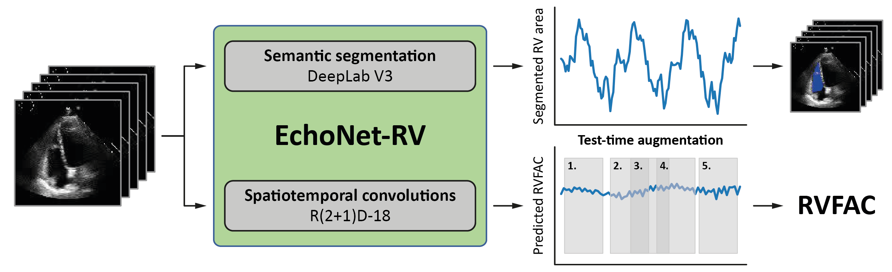
<div align="center"><i><b>Figure 1.</b> Schematic illustration of EchoNet-RV's architecture</i></div>

## Datasets used for training and evaluation of EchoNet-RV

<b>Stanford dataset:</b> The Stanford dataset, used for model development and internal validation, comprised a total of 8,489 A4C videos from 8,314 studies of 5,386 patients who underwent transthoracic echocardiography between 2016 and 2018 as part of clinical care at Stanford Health Care (California, USA). Videos were randomly split into three sets of 5,892, 1,277, and 1,320 videos for training, validation, and testing, respectively. Splitting was performed at the patient level to avoid including videos from the same patient in more than one of the three sets.

<b>Semmelweis dataset:</b> The Semmelweis dataset, used for external validation and for assessing the prognostic value of the predicted RVFAC values, consisted of a total of 3,107 A4C videos from 982 studies of 872 patients who underwent transthoracic echocardiography between 2013 and 2021 at the Heart and Vascular Center of Semmelweis University (Budapest, Hungary).

<b>MacKay Memorial Hospital dataset:</b> The MacKay Memorial Hospital (MMH) dataset, also used for external validation, included a total of 1,077 A4C videos from 1,077 studies of 1,077 patients who underwent transthoracic echocardiography between 2009 and 2022 at MacKay Memorial Hospital (Taipei, Taiwan).

<b>University of Occupational and Environmental Health dataset:</b> The third external test set comprised 1,315 A4C videos from 341 studies of 341 patients who underwent transthoracic echocardiography between January 2014 and December 2020 at the University Hospital of the University of Occupational and Environmental Health (UOEH; Kitakyushu, Japan).

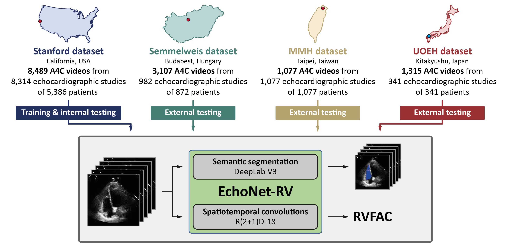
<div align="center"><i><b>Figure 2.</b> Training and evaluation of EchoNet-RV</i></div>

## Performance of EchoNet-RV

### Performance in RV segmentation

EchoNet-RV’s segmentation module segmented the RV in all human-annotated end-diastolic and end-systolic frames with Dice coefficients of 0.893 (95% CI: 0.891–0.895), 0.797 (95% CI: 0.795–0.798), 0.788 (95% CI: 0.785–0.790), and 0.826 (95% CI: 0.820–0.832) in the held-out internal test set and the Semmelweis, MMH, and UOEH datasets, respectively.

<div align="center">
<table>
  <tr>
    <td>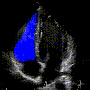</td>
    <td>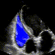</td>
    <td>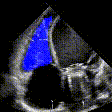</td>
    <td>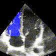</td>
  </tr>
  <tr>
    <td>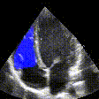</td>
    <td>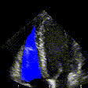</td>
    <td>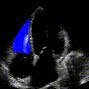</td>
    <td>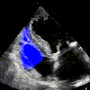</td>
  </tr>
  <tr>
    <td>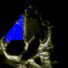</td>
    <td>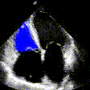</td>
    <td>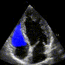</td>
    <td>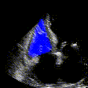</td>
  </tr>
</table>
<i><b>Figure 3.</b> Representative examples of semantic segmentation outputs</i>
</div>

### Performance in RVFAC prediction

EchoNet-RV predicted RVFAC with mean absolute errors (MAEs) of 5.795 (95% CI: 5.560–6.031), 5.830 (95% CI: 5.692–5.970), 6.362 (95% CI: 6.064–6.660), and 4.937 (95% CI: 4.723–5.155) percentage points and intraclass correlation coefficients (ICCs) of 0.648 (95% CI: 0.616–0.677), 0.481 (95% CI: 0.452–0.509), 0.301 (95% CI: 0.243–0.356), and 0.632 (95% CI: 0.598–0.664) in the held-out internal test set and the Semmelweis, MMH, and UOEH datasets, respectively. Bland-Altman analysis showed biases of 0.233, 1.275, -2.635, and -2.316 percentage points, along with limits of agreement (LOA) widths of 30.260, 28.837, 29.987, and 23.212 percentage points, in the four test sets, respectively.

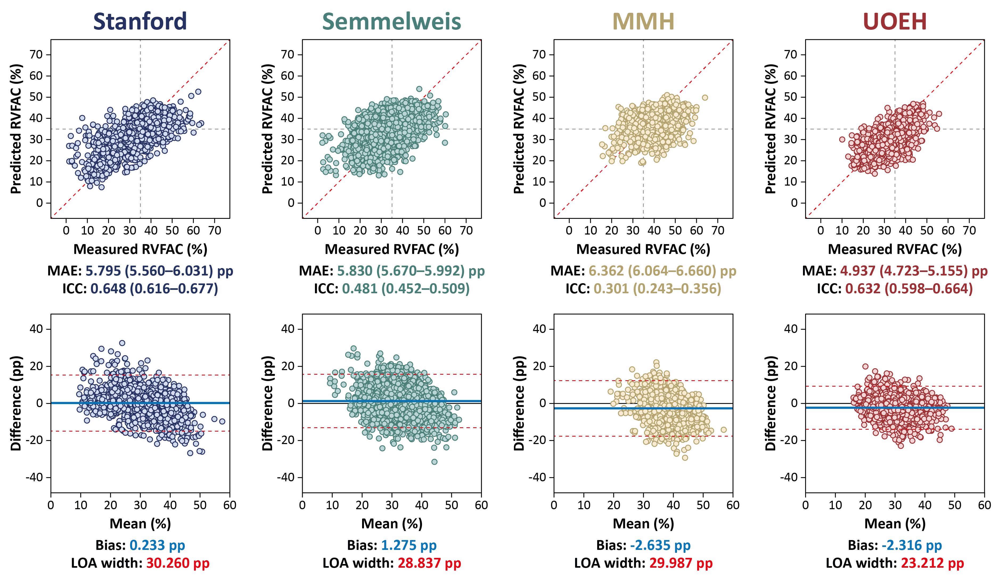
<div align="center"><i><b>Figure 4.</b> Performance of EchoNet-RV in RVFAC prediction</i></div>

<br/><br/>
EchoNet-RV was also found to outperform previously published deep learning models in both RVFAC prediction and the detection of RV dysfunction (RVFAC <35%) in the external test sets.

<div align="center">

<table>
  <tr>
    <th></th>
    <th>EchoNet-RV</th>
    <th><a href="https://pubmed.ncbi.nlm.nih.gov/38290912/">U-Net KP</a></th>
    <th><a href="https://pubmed.ncbi.nlm.nih.gov/41219498/">EchoPrime</a></th>
    <th><a href="https://pubmed.ncbi.nlm.nih.gov/40549400/">PanEcho</a></th>
  </tr>

  <tr>
    <td align="center"><b>Semmelweis dataset</b></td>
    <td></td><td></td><td></td><td></td>
  </tr>
  <tr>
    <td align="center">MAE, pp</td>
    <td align="center">5.830<br>(5.670–5.992)</td>
    <td align="center">6.602<br>(6.415–6.794)</td>
    <td align="center">6.171<br>(6.002–6.339)</td>
    <td align="center">–</td>
  </tr>
  <tr>
    <td align="center">ICC</td>
    <td align="center">0.481<br>(0.452–0.509)</td>
    <td align="center">0.432<br>(0.400–0.463)</td>
    <td align="center">0.423<br>(0.394–0.450)</td>
    <td align="center">–</td>
  </tr>
  <tr>
    <td align="center">AUC (RVFAC &lt;35%)</td>
    <td align="center">0.727<br>(0.709–0.744)</td>
    <td align="center">0.707<br>(0.689–0.725)</td>
    <td align="center">0.683<br>(0.664–0.701)</td>
    <td align="center">0.673<br>(0.654–0.692)</td>
  </tr>

  <tr>
    <td align="center"><b>MMH dataset</b></td>
    <td></td><td></td><td></td><td></td>
  </tr>
  <tr>
    <td align="center">MAE, pp</td>
    <td align="center">6.362<br>(6.064–6.660)</td>
    <td align="center">8.791<br>(8.392–9.217)</td>
    <td align="center">6.728<br>(6.406–7.048)</td>
    <td align="center">–</td>
  </tr>
  <tr>
    <td align="center">ICC</td>
    <td align="center">0.301<br>(0.243–0.356)</td>
    <td align="center">0.178<br>(0.116–0.235)</td>
    <td align="center">0.192<br>(0.127–0.253)</td>
    <td align="center">–</td>
  </tr>
  <tr>
    <td align="center">AUC (RVFAC &lt;35%)</td>
    <td align="center">0.684<br>(0.648–0.719)</td>
    <td align="center">0.596<br>(0.555–0.633)</td>
    <td align="center">0.652<br>(0.614–0.690)</td>
    <td align="center">0.657<br>(0.619–0.695)</td>
  </tr>

  <tr>
    <td align="center"><b>UOEH dataset</b></td>
    <td></td><td></td><td></td><td></td>
  </tr>
  <tr>
    <td align="center">MAE, pp</td>
    <td align="center">4.937<br>(4.723–5.155)</td>
    <td align="center">7.984<br>(7.658–8.291)</td>
    <td align="center">6.173<br>(5.921–6.430)</td>
    <td align="center">–</td>
  </tr>
  <tr>
    <td align="center">ICC</td>
    <td align="center">0.632<br>(0.598–0.664)</td>
    <td align="center">0.333<br>(0.288–0.377)</td>
    <td align="center">0.393<br>(0.346–0.436)</td>
    <td align="center">–</td>
  </tr>
  <tr>
    <td align="center">AUC (RVFAC &lt;35%)</td>
    <td align="center">0.855<br>(0.834–0.876)</td>
    <td align="center">0.666<br>(0.637–0.695)</td>
    <td align="center">0.692<br>(0.663–0.720)</td>
    <td align="center">0.730<br>(0.702–0.757)</td>
  </tr>
</table>

<i><b>Table 1.</b> Performance of EchoNet-RV compared with previously published models</i>

</div>

## Usage

### Installation

Follow the steps below to install EchoNet-RV:
1) If you plan to run EchoNet-RV on a CUDA-enabled GPU, ensure that the CUDA Toolkit installed on your system is compatible with the PyTorch version specified in `requirements.txt`.
2) Clone the repository to your desired location:
```
git clone https://github.com/echonet/rv.git
```
3) Create and activate a Python virtual environment dedicated to this project. Model development and testing were performed using Python 3.10; therefore, we recommend using this version of Python.
4) Navigate to the cloned repository and install the required dependencies and EchoNet-RV:
```
pip install -r requirements.txt
pip install .
```

<b>NOTE:</b> The inference scripts automatically download the required model weights, so there is no need to download them manually.

### Preprocessing DICOM files

Run the following command to preprocess the DICOM files:
```
python -m echonet preprocess --data_dir /path/to/dicom/files --output /path/to/output/videos --crop_size 112 112 --flip False
```

The preprocessed videos will be saved as `.avi` files in the specified output directory. During preprocessing, the pixel arrays are extracted from the DICOM files, leading near-black rows are removed, frames are center-cropped to a square field of view with an additional 10% margin crop, and a triangular mask is applied to exclude pixels outside the ultrasound sector. The frames are then resized to 112 × 112 pixels using bicubic interpolation.

<b>NOTE:</b> EchoNet-RV accepts B-mode A4C videos without color Doppler, including both standard and RV-focused views. The model expects A4C videos to be in Stanford orientation, with the left ventricle on the right side of the image and the RV on the left. If a video is in Mayo orientation, with the RV on the right and the left ventricle on the left, it should be horizontally flipped by setting `--flip` to `True` when running the preprocessing script.

### Running inference

#### Semantic segmentation of the RV

The following command performs frame-by-frame semantic segmentation of the RV cavity and saves the resulting outputs to the specified directory:
```
python -m echonet segmentation_inference --data_dir /path/to/input/videos --output /path/to/output
```

#### Prediction of RVFAC

The following command predicts RVFAC directly from the preprocessed videos and saves the results to the specified output location:
```
python -m echonet rvfac_inference --data_dir /path/to/input/videos --output /path/to/output
```

## Contact

For inquiries related to EchoNet-RV, contact Márton Tokodi, M.D., Ph.D. (tok<!--
-->odi.mar<!--
-->ton[at]semmelweis.h<!--
-->u) or David Ouyang, M.D. (davi<!--
-->d.ouy<!--
-->ang[at]kp.o<!--
-->rg).
